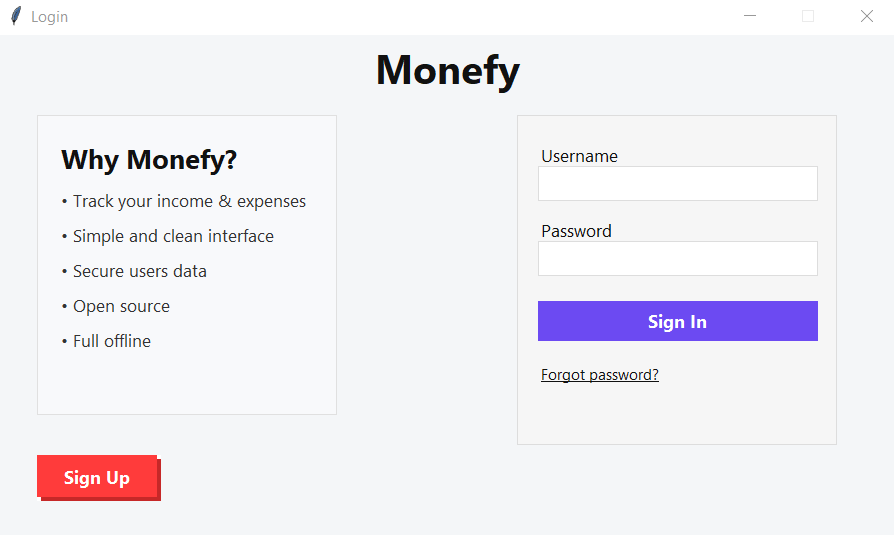
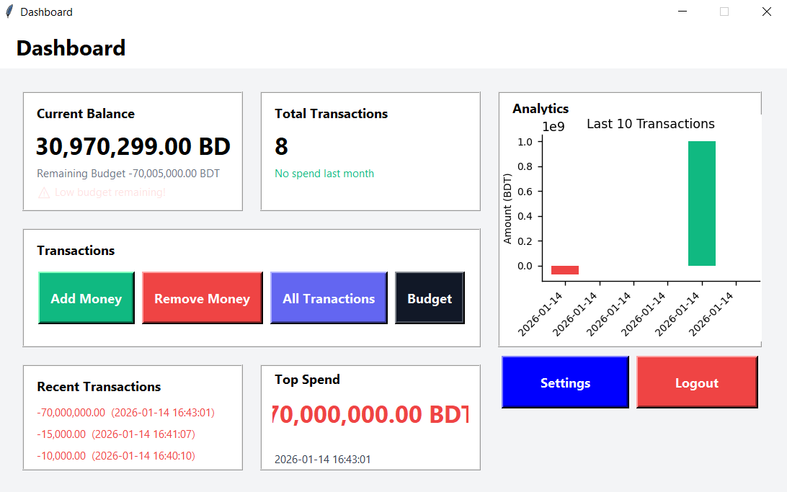
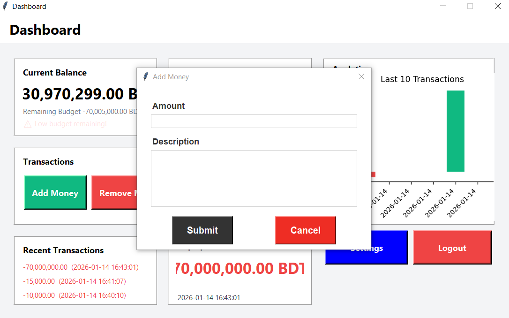
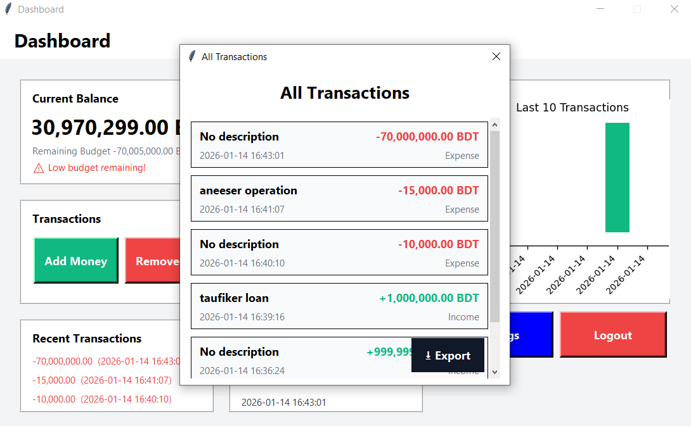

# 💰 Monefy – Money Management System


[](https://www.python.org)


Monefy is a **desktop-based money management system** built using **Python and Tkinter**, designed to help users track income, expenses, and gain insights into their financial habits. The application works **offline**, stores user data locally, and can be packaged as a **Windows executable**.

---

## 📑 Table of Contents
- [Features](#-features)
- [Screenshots](#-screenshots)
- [Requirements](#-requirements)
- [Installation](#-installation)
- [Contributors](#-contributors)
- [Contributing Guidelines](#-contributing-guidelines)
- [Changelog](#-changelog)
- [License](#-license)


## ✨ Features

### 🔐 Authentication & User Management
- User signup with input validation
- Secure login system
- Forgot password functionality
- Automatic session handling (remember logged-in user)
- Per-user local data storage

---

### 📊 Dashboard
- Total balance overview
- Monthly income and expense summary
- Recent transactions display
- User profile and greeting
- Clean and modern Tkinter UI

---

### 💸 Transactions Management
- Add income transactions
- Add expense transactions
- Transaction notes and timestamps


---

### 📈 Analytics & Reports
- Income vs expense comparison
- Highlights top spending categories


---

### 📤 Export & Backup
- Export transaction data to Excel (.xlsx)
- Export to CSV format


---

### ⚙️ Settings
- Update user profile details
- Change password
- Reset user data

---

### 🖥 System & Application Features
- Windows executable (.exe) support via PyInstaller
- Custom application icon
- Data stored securely in APPDATA
- Offline-first application
- Lightweight and fast startup
- Friendly error handling and alerts

---

### 🔒 Security
- Password hashing
- Input validation and sanitization
- Basic file access protection
- Session-based login control

---

### 🚀 Future Enhancements
- ~~Budget planning and alerts~~
- ~~User report section~~
- ~~Category-wise spending insights~~
- ~~Search transactions by name or notes~~
- Recurring transactions
- Advanced analytics
- Cloud sync support
- Multi-device support
- Mobile version (planned)
- More modern GUI
- Add and view other accounts of family members or others
- Theme customization
- Local backup and restore system
- Filter by category
- Filter by date range
- Filter by income or expense type
- Date-range based filtering
- Monthly expense charts
- Edit existing transactions
- Delete transactions
- Quick add transaction option


---

## 🛠 Tech Stack
- **Language:** Python
- **GUI:** Tkinter
- **Storage:** JSON (Local)
- **Packaging:** PyInstaller
- **Platform:** Windows

---


## 📦 Installation
1. Clone the repository
   ```bash
   git clone https://github.com/yourusername/monefy.git

2. Make executable with PyInstaller  
   Install PyInstaller (if not already)

   ```bash
   pip install pyinstaller
   pyinstaller --onefile --windowed --icon=icon.ico main.py

---


## 🛠 Requirements

Before running **Monefy**, make sure you have the following installed:

### Python
- **Python 3.10+** (or higher)  
  Download: [https://www.python.org/downloads/](https://www.python.org/downloads/)

### Python Packages
Install the required packages using `pip`:

```bash
pip install -r requirements.txt
```


----

## 🤝 Contributors

Thanks to everyone who has contributed to this project!  

### Lead Developer
- **Rafiul** – [GitHub](https://github.com/yourusernamerafiulrafi55) – Original creator, Python & Tkinter development

### Contributors
- **Mantasha** – [GitHub](https://github.com/mehjabinislam2913) – Project partner / bug fixing and testing


---

## 🤝 Contributing Guidelines

We welcome contributions to improve **Monefy**! Whether it’s bug fixes, new features, or UI improvements, you can help make the project better.  

### How to Contribute
1. **Fork the repository**  
   Click the **Fork** button at the top-right of the GitHub page.

2. **Clone your fork**  
   ```bash
   git clone https://github.com/yourusername/monefy.git
   cd monefy

---

## 📝 Changelog

### v1.0.1 - 2026-01-15
- Fixed bug - transactions menu doesn't show expenses after setting budget


### v1.0.0 – 2026-01-14
- Initial release with dashboard, transactions, and analytics.


---


## ❗ Troubleshooting
- If `tkinter` is not installed: `pip install tk`
- If PyInstaller fails: ensure you run `pip install pyinstaller` in the same environment


---


You can add yourself to this list if you fork or contribute.  

<p align="center">
  <b>Want to contribute?</b> Check out the <a href="#-contributing-guidelines">Contributing Guidelines</a> above.
</p>


---


## 📄 License
This project is licensed under the **GNU General Public License v3.0 (GPLv3)**.  
See the full license here: [LICENSE](LICENSE)


---

## 🖼 Screenshots


### Login Screen


### Dashboard


### Add Transaction


### Transactions

